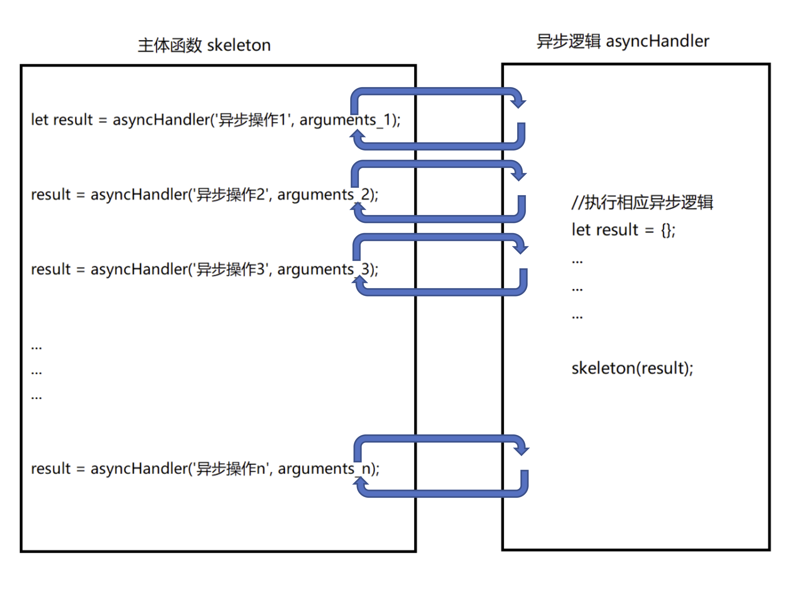

> 附 1: [Promise/A+的个人版本实现](../2-PromiseA+实现)

> 附 2: [基于 Promise/Generator/Iterator 实现简易版的 co(待定)]()

# callback 与回调地域

- `javascript`传统异步方式：回调。
- `回调地域`

  以 ajax 为例，假设有 N 个 ajax 操作，下一个 ajax 必须在上一个 ajax 接收并处理完响应后发起；
  不可以借助于一些支持 async: false 的 ajax 工具库，保证 N 个 ajax 彼此有序；
  则代码思路如下：

```javascript
ajax('/ajax1连', function() {
  ajax('/ajax2连', function() {
    ajax('/ajax3连', function() {
      //... ....
      ajax('/ajaxN连', function() {
        console.log('吐血！！！！！！');
      });
    });
  });
});
```

一旦上游`ajax`回调里传递的数据发生了变化，很有可能，下游的`ajax`都需要相应调整各自的入参。

# 目标：遍历各异步操作

## while/do while/for

- 循环是同步逻辑，同步代码在当前`执行上下文EC`中顺序执行。
- `异步任务`在`任务队列`中(又分为`微任务`及新的`宏任务`)，只有当`执行栈`清空时，主线程才会根据`事件轮询`机制从`任务队列`中获取异步任务并执行。
- 循环代码无法访问其它`执行环境`中的变量，无法驱动状态变化，循环无法终止。

## 递归

递归的思路大致如下：



`主体函数`：每当遇到异步操作，就递归跳转至异步处理逻辑。

```javascript
function skeleton(...arguments) {
  //...
  let result = asyncHandler('异步操作0'); //递归跳转至异步操作
  handle(result);

  //...
  result = asyncHandler('异步操作1'); //递归跳转至异步操作
  handle(result);

  //...
  //...
  result = asyncHandler('异步操作N'); //递归跳转至异步操作
  handle(result);
}
```

`异步处理器`：执行异步代码，并连带着结果，递归跳转回主体函数。

```javascript
function asyncHandler(...arguments) {
  //处理异步逻辑，并递归跳转回主体函数
  skeleton(result);
}
```

迭代的过程，就是在`主体函数`和`异步处理器`之间相互切换执行的递归的过程。

### 主体函数: 通过 es6 中的 generator 实现

`generator`(生成器函数)是`es6`语法规范，用于生成遍历对象：

```javascript
function* g() {
  yield 'obj1';
  yield 'obj2';
  //...
  yield 'objn';
}

const iterator = g();
iterator.next();
```

    g是一个简单的生成器函数，被调用后得到一个遍历器实例iterator;
    每次通过iterator调用next，g就从上一次yield结束的地方开始，执行到下一次yield, 再停下来。yield生成并返回遍历对象。
    generator本质上是一个状态机，每次只执行一部分代码，拿到下一个遍历对象后就停止当次迭代，并等待下一次的迭代请求。

在上面的递归思路中，使用`generator`作为主体函数，每次通过`yield`生成`异步处理器`，然后停下来，并切换到异步操作。

接下来是`异步处理器`的实现：

- `异步处理器`语法逻辑必须统一，才能实现递归操作。
  - 它本质上就是一个封装异步操作，使之标准化的统一接口。
- `callback`回调模式里，开发者可以花式自定义参数，不满足这一要求。

### 异步接口标准化

#### Thunk

- `Thunk`是非官方的异步接口标准化方案，通过限制回调模式的参数类型，来让异步操作标准化。
- `Thunk`不能从语法层面上强制统一，开发者需自觉遵守相应的参数规范，不能完全解决问题。

#### Promise

`es6`推出的统一的异步接口标准化的方案，语法如下：

```javascript
const p = new Promise((resolve, reject) => {
  /**
   *同步区域的代码逻辑。
   */
  if ('error happened') {
    return reject('error object');
  }

  return resolve('success result');
});

p.then((data) => {
  /**
   *异步区域的代码逻辑：promise成功执行，状态onfulfilled, 处理成功结果。
   */
}).catch((err) => {
  /**
   *异步区域的代码逻辑：promise执行异常，状态onrejected, 处理异常结果。
   */
});
```

`Promise`实例的目标状态，只能为`onfulfilled`或`onrejected`其中一种，相应异步处理逻辑也只能执行其中的一个。

    通过generator实现主体函数，利用promise作为统一的异步操作接口，再结合iterator遍历器语法，
    就可以自动的实现各异步操作之间的递归方式的遍历，从而摆脱callback方式带来的回调地域。

    这个递归函数被称为自动执行器函数。

## 自动执行器：递归方式遍历异步操作

### co

`co`是一个第三方开源的`自动执行器`实现。

只要`generator`函数每次`yield`的对象是`Thunk`或`Promise`这样的异步接口，或者可以被转换为`Promise`,
就可以调用`co`来自动遍历各`异步操作`。

源码解析：[待定]()

### async 函数

`es2017`官方实现的`自动执行器`，综合了`Promise` & `generator` & `iterator`的特性。

```javascript
async function ag() {
  await Promise1;
  await Promise2;
  //...
  await PromiseN;
}
```

`async`函数体内就是它的`generator函数`，只不过将`yield`语法换为了`await`,
表示它生成的是一个异步的对象，且对象必须为`Promise`(或可被转换为`Promise`);

调用`async`函数，就是自动执行相应的遍历器`iteraotr`来遍历各`异步操作`的过程。

源码实现：[待定]()

> mongodb node driver 有个非常经典的例子

在没有使用`Promise`之前，查询数据库数据之后，如果想要直观的遍历结果，大致代码如下：

```javascript
cursor.next(function(err, r) {
  test.equal(null, err);
  console.log(r.data);

  cursor.hasNext(function(err, r) {
    test.equal(null, err);
    test.ok(r);

    cursor.next(function(err, r) {
      test.equal(null, err);
      console.log(r.data);

      cursor.hasNext(function(err, r) {
        test.equal(null, err);
        test.ok(r);

        cursor.next(function(err, r) {
          test.equal(null, err);
          console.log(r.data);

          cursor.hasNext(function(err, r) {
            test.equal(null, err);
            test.ok(!r);

            db.close();
          });
        });
      });
    });
  });
});
```

这是一个典型的回调地域。

但是，`mongodb node driver`约定回调函数的参数必须符合(err, record)的形式，基于此，
`mongodb node driver`实现了自己的`自动执行器` `toArray()`。

    toArray方法将结果转换为数组时，已经遍历了一次数据，在这个遍历期间，我们不能做任何的业务操作；
    拿到数组结果后，我们才能对其进行遍历，执行自己的业务逻辑；

    也就是说，为了执行业务逻辑，至少需要两次遍历过程，这是一种性能上的浪费。

    如果想一次遍历就能完成自己的业务逻辑，我们就必须通过上面的递归思路，来实现自己的自动执行器。

但是，有了`Promise`&`generator`&`iterator`之后，我们就可以借助于`co`或原生的`async函数`，来快速实现我们的业务需求。

`async函数`版本代码如下:

```javascript
(async function() {
  while (await cursor.hasNext()) {
    const data = await cursor.next();
    //处理遍历到的数据
    console.log(data);
  }
})();
```

非常的简便。

## Promise everywhere

### mongodb node driver

`mongodb node driver`中的异步操作的 API 已经全部支持`Promise`

### axios

基于`Promise`的一套异步 API, 在浏览器端就是加强的版的`XMLHttpRequest`, 在 node 环境下就是加强版的`http`请求。

### import()

`es6+`官方规范里，动态加载包的语法，返回`Promise`.

### koa

- `koa`和`express`框架是同一个开发团队维护的两个不同的基于中间件的`http`框架。
  - `koa`在异步方案上选择了`async函数`，来控制各`异步操作`之间的流程。
    - `egg.js`基于`koa`而不是`express`进行扩展。
    - `async函数`核心是`Promise`方案，相对更为稳妥。
  - `express`在异步方案上选择了`callback`回调模式，各`异步操作`之间的流程控制更为复杂。

### node: promisify

> [返回]({{site.baseurl}}/Promise总结)
